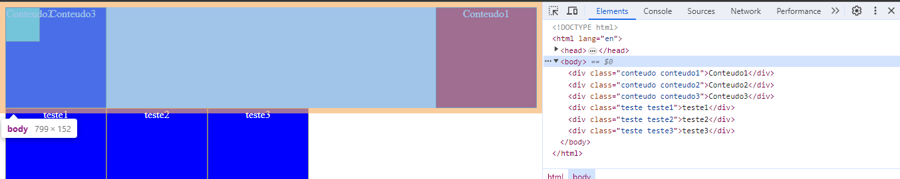

o Float funciona como se deixa-se o elemente solto dentro da página principal.
Ele não é reconhecido por outros elementos, a não ser, que esse outro elemento seja float também.
Caso o elemento não seja float, o elemento float passa por cima do elemento static, como se ele estive-se em outra camada.

Note que o meu body apenas marca a  parte aonde está o `Conteudo3`, pois, ele é o unico que não é um Float.
Logo, o arquivo entende que ele é o meu body, o resto é como se fosse outra coisa