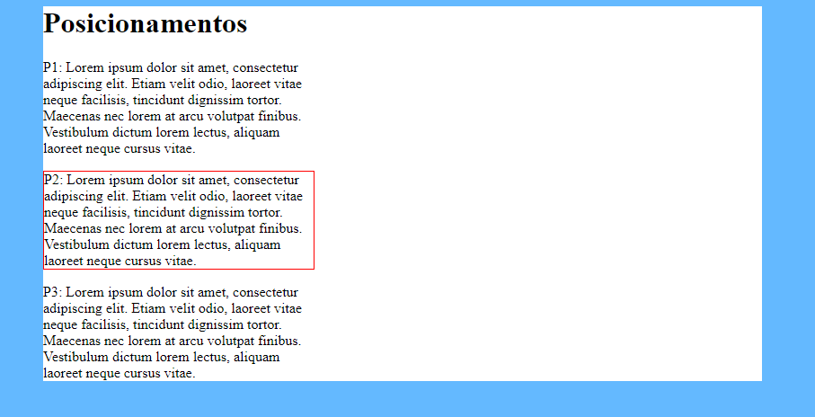
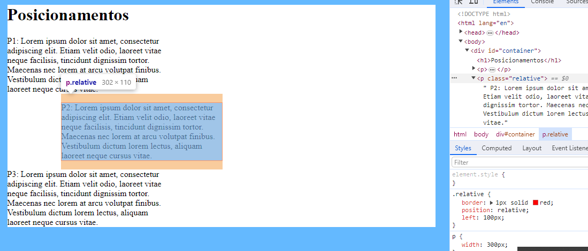
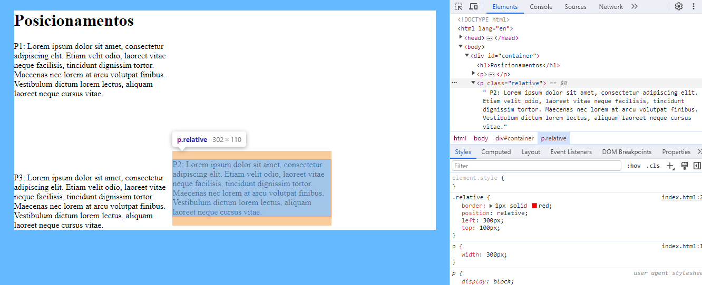

Podemos trocar o posicionamento dos nossos elementos/blocos usando a propriedade chamada de position;
Por padrão a position é static, ou seja, se eu definir `position:Static` ele vai seguir o fluxo padrão do html;



`position: relative`

usando o relative, o nosso bloco vai seguir um posicionamento relativo ao seu posicionamento de origem:

```css
.relative{
            border: 1px solid red;
            position: relative;
            left: 100px;
        }
```




```css
.relative{
            border: 1px solid red;
            position: relative;
            left: 300px;
            top: 100px;
        }
```

