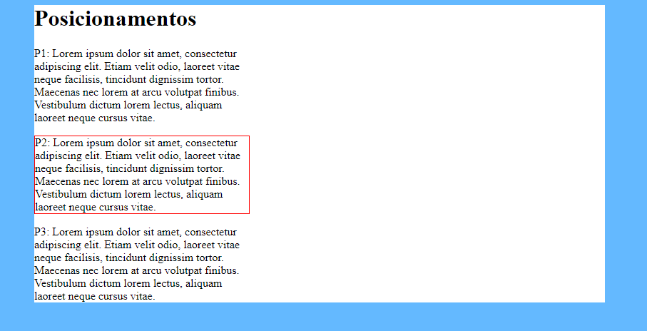
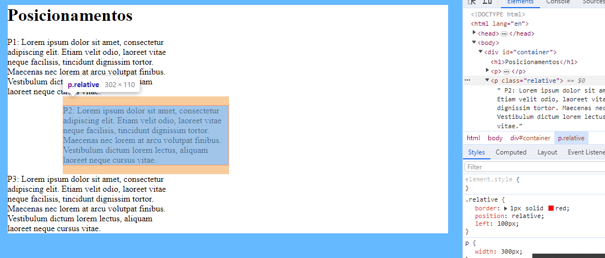
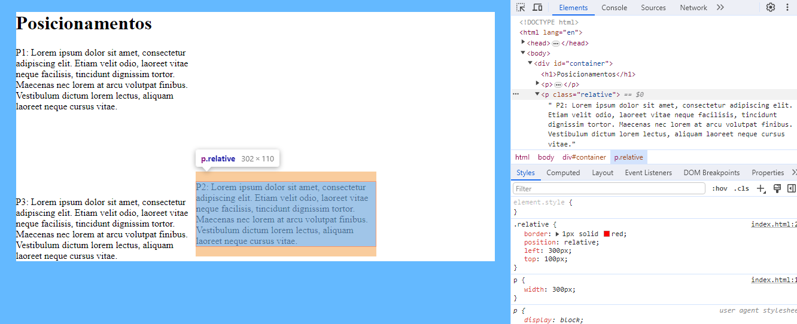
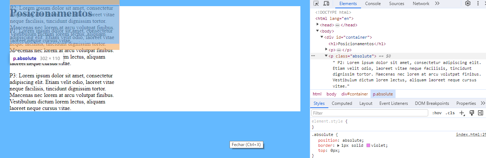
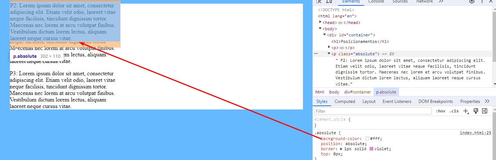
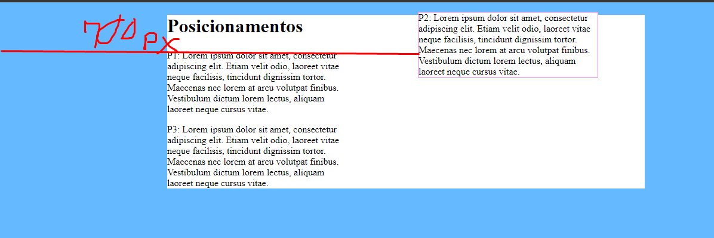
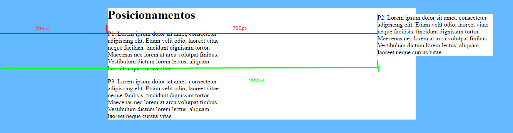

# Static e Relative

Podemos trocar o posicionamento dos nossos elementos/blocos usando a propriedade chamada de position;
Por padrão a position é static, ou seja, se eu definir `position:Static` ele vai seguir o fluxo padrão do html;



`position: relative`

usando o relative, o nosso bloco vai seguir um posicionamento relativo ao seu posicionamento de origem:

```css
.relative{
            border: 1px solid red;
            position: relative;
            left: 100px;
        }
```




```css
.relative{
            border: 1px solid red;
            position: relative;
            left: 300px;
            top: 100px;
        }
```




#Absolute e fix

Quando a gente define uma `position: absolute` ele sai do fluxo normal do documento e ele não afeta a posição dos outros elementos da página;



Porém ele funciona como se fica-se por cima do elemento, então, ele pode acabar tampando o outro elemento, veja:




Ele vai ser posicionado de acordo com o seu container, porém se o seu container não tiver uma `position!= static` ele vai ser posicionado de acordo com a página


```css
.absolute{
            position: absolute;
            border: 1px solid violet;
            top: 0px;
            background: #fff;
            left: 700px;
        }
```



Pórem, ele pode ser posicionado de acordo com o meu container, basta colocar o meu container como relative:




também existe o `position: fixed`, que ele fez com que o elemento fique fixo na minha página, ou seja, mesmo se eu rolar a página ele vai ficar fixo e acompanhar a página.